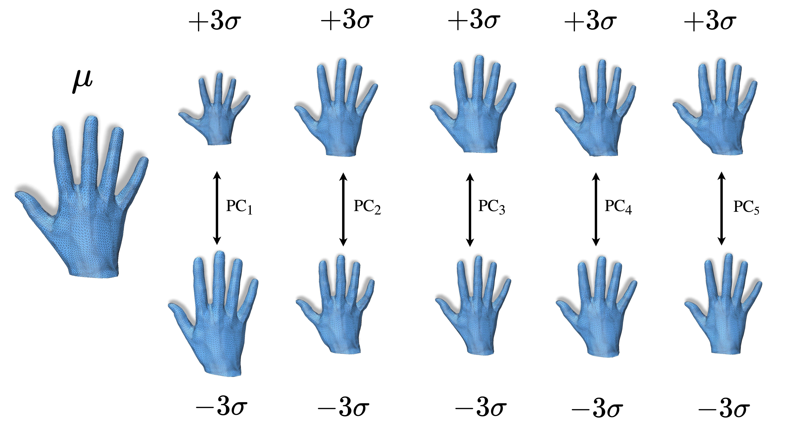
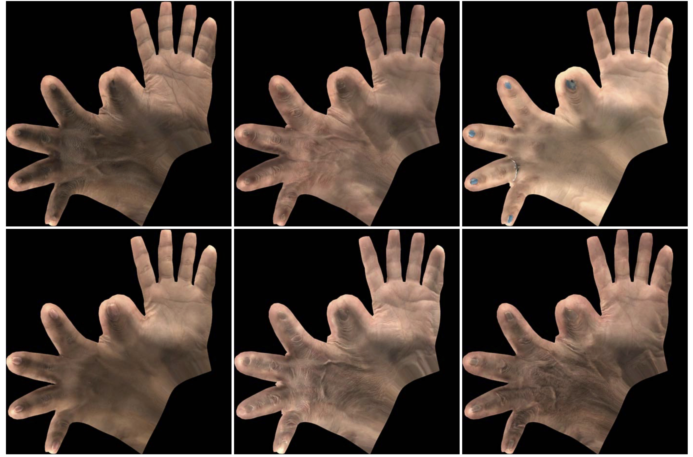

# Handy: Towards a high fidelity 3D hand shape and appearance model
<H4 align="center">
Rolandos Alexandros Potamias, Stylianos Ploumpis, Stylianos Moschoglou, Vasileios Triantafyllou, Stefanos Zafeiriou
</H4>
<p align="center"> Imperial College London</p>
<p align="center"> Published in the IEEE/CVF Conference on Computer Vision and Pattern Recognition (CVPR 2023)</p>

<p align="center"></p>

## Abstract

Over the last few years, with the advent of virtual and augmented reality, an enormous amount of research has been focused on modelling, tracking and reconstructing human hands. Given their power to express human behaviour, hands have been a very important, but challenging component of the human body. Currently, most of the state-of-the-art reconstruction and pose estimation methods rely on the low polygon MANO model. Apart from its low polygon count, MANO model was trained with only 31 adult subjects, which not only limits its expressive power but also imposes unnecessary shape reconstruction constraints on pose estimation methods. Moreover, hand appearance remains almost unexplored and neglected from the majority of hand reconstruction methods. In this work, we propose "Handy", a large-scale model of the human hand, modelling both shape and appearance composed of over 1200 subjects which we make publicly available for the benefit of the research community. In contrast to current models, our proposed hand model was trained on a dataset with large diversity in age, gender, and ethnicity, which tackles the limitations of MANO and accurately reconstructs out-of-distribution samples. In order to create a high quality texture model, we trained a powerful GAN, which preserves high frequency details and is able to generate high resolution hand textures. To showcase the capabilities of the proposed model, we built a synthetic dataset of textured hands and trained a hand pose estimation network to reconstruct both the shape and appearance from single images. As it is demonstrated in an extensive series of quantitative as well as qualitative experiments, our model proves to be robust against the state-of-the-art and realistically captures the 3D hand shape and pose along with a high frequency detailed texture even in adverse "in-the-wild" conditions. 
</br>

## Hand Model 
The proposed **Handy** model is composed by a shape and an appearance model. The construction of both models was done after non-rigid registration of the hand template to the raw scans. 
</br>

### Shape Model 
After having all the 3D raw hand scans into dense correspondence with the template, we normalise them to a canonical open-palm pose to avoid capturing any unnecessary deformations into our final shape model. We construct a deformable hand shape model described as a linear basis of shapes. In particular, using PCA, we build a hand model with $N$ vertices that is described by an orthonormal basis after keeping the first $n_c$
principal components $\textbf{U} \in \mathcal{\mathbb{R}} ^{3N \times n_c}$ and their associated $\lambda$ eigenvalues. New hand instances can then be generated by regressing the shape parameters $\boldsymbol{{\beta}} = [\beta_0, \beta_1, ..., \beta_{n_c}] \in \mathcal{\mathbb{R}} ^ {n_c} $ as: 

$${B_s}(\boldsymbol\beta) = \mathbf{T} + \sum_{i=0}^{n_c} \mathbf{U_i \beta_i}  \in \mathcal{\mathbb{R}} ^{3N}$$
where $\mathbf{T} \in \mathcal{\mathbb{R}} ^{3N}$ refers to the mean hand shape. 

<p align="center"></p>

**Additional to the high resolution hand template used in the paper, we release the Handy shape model using MANO template so that it can be directly adapted to any project that uses MANO model.** 

</br>

### Appearance Model
To model the hand textures we utilised the powerful [StyleGAN-v3 architecture](https://github.com/NVlabs/stylegan3). Utilising such GAN architecture, we are capable of preserving the high frequency details such as veins, wrinckles and nail polish whilst avoiding any smoothness created by a PCA models. 

<p align="center"></p>

</br>

## Public release models
Both shape and appearance models will be publicly available for research and education purposes soon. 
## Citation 

If you find this work is useful for your research, please consider citing our paper. 

```
@InProceedings{potamias2023handy,
  author = {Potamias, Rolandos Alexandros and Ploumpis, Stylianos and Moschoglou, Stylianos and Triantafyllou, Vasileios and Zafeiriou, Stefanos},
  title = {Handy: Towards a high fidelity 3D hand shape and appearance model},
  booktitle = {Proceedings of the IEEE/CVF Conference on Computer Vision and Pattern Recognition (CVPR)},
  month = {June},
  year = {2023}
}
```
